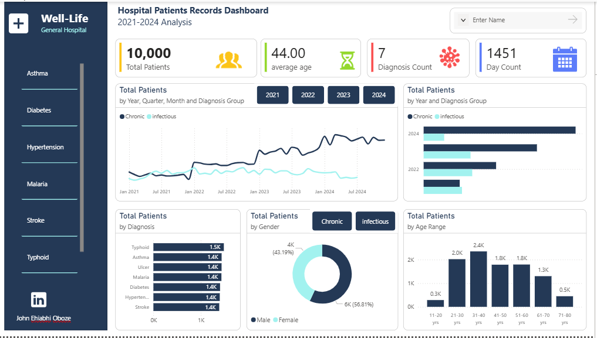
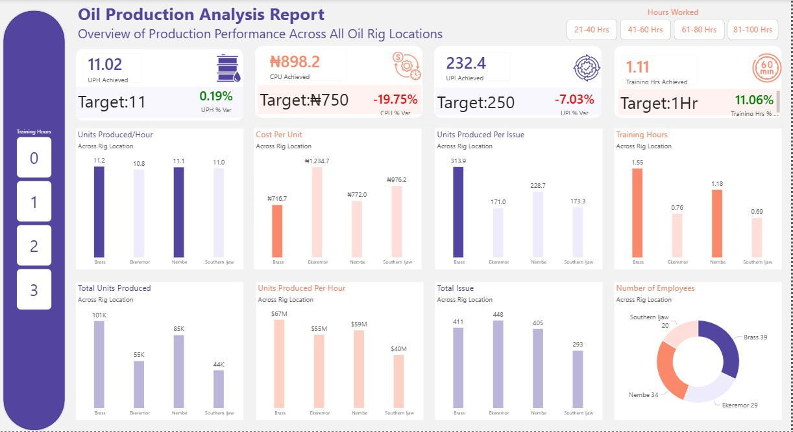

# Data-Analytics-Portfolio
## About Me
Hello, I am John Ehiabhi Oboze, a Data Analyst and problem solver passionate about helping businesses grow using Data and turning data into actionable insight for decision making.
I am isnspired and motivated into Senior Data Analyst role, and helping African businesses make smarter decisions. I have built data dashboards that increase team productivity and performance by a huge margin.

## Skills
Data visualization - Power BI, Excel and SQL

I build dashboards and reporting visuals that helps stakeholder make quicker and faster decisions. 
[click here](https://www.linkedin.com/posts/john-ehiabhi-oboze-59189a123_dataanalytics-powerbi-excel-activity-7434185042467381252-mF06?utm_source=share&utm_medium=member_desktop&rcm=ACoAAB6Qr70B32_ZC4Y2BfMNuyqOd9-uhjLDlDs) Data Analytics coaching session [click here](https://www.linkedin.com/posts/john-ehiabhi-oboze-59189a123_dataanalytics-datacommunity-mentorship-activity-7472616963547185152-bHoX?utm_source=share&utm_medium=member_desktop&rcm=ACoAAB6Qr70B32_ZC4Y2BfMNuyqOd9-uhjLDlDs)

## Projects
WellLife General Hospital - Patient Admissions Analysis (2021-2024)

I analyzed 10,000 patient admissions (2021-2024) for WellLife General Hospital. While malaria and typhoid dominated previous years, 2024 showed a rise in hypertension and stroke cases, with typhoid dropping off entirely. My insights guided the hospital to reallocate resources and shift from general to specialized care, preventing wasteful spending on outdated patient trends.
[View Report Here](https://www.linkedin.com/posts/john-ehiabhi-oboze-59189a123_jkt-healthcareanalytics-publichealth-activity-7466031589572136960-o6A-?utm_source=share&utm_medium=member_desktop&rcm=ACoAAB6Qr70B32_ZC4Y2BfMNuyqOd9-uhjLDlDs)

Automated Production Tracker

I developed an automated variance analysis tracker to monitor rig locations against production targets. Investigation revealed that only one location consistently met goals, with training hours directly affecting output. My tracker automated reporting enabling weekly monitoring, better training allocation, and improved production across all sites. 
{View Report Here}(https://www.linkedin.com/posts/john-ehiabhi-oboze-59189a123_dataanalytics-dashboardanalysis-operationalanalytics-activity-7454446019146117120-w7DL?utm_source=share&utm_medium=member_desktop&rcm=ACoAAB6Qr70B32_ZC4Y2BfMNuyqOd9-uhjLDlDs)
