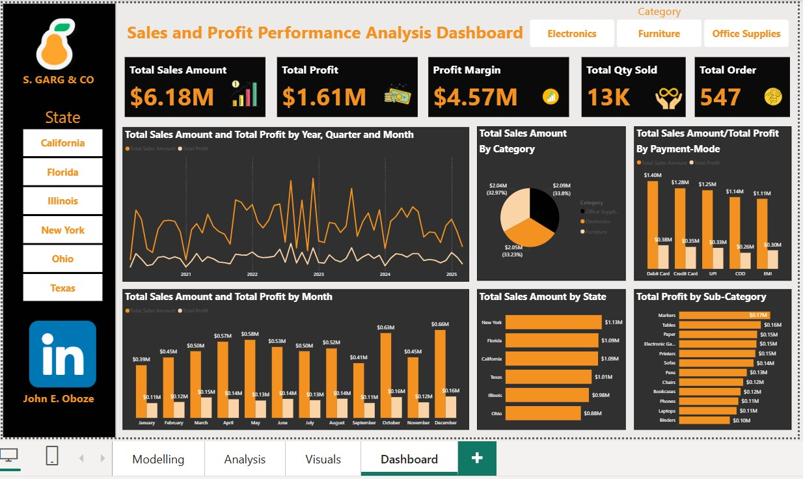

# Data-Analytics-Portfolio
## About Me
Hello, I am John Ehiabhi Oboze, a Data Analyst and problem solver passionate about helping businesses grow using Data and turning data into actionable insight for decision making.
I am isnspired and motivated into Senior Data Analyst role, and helping African businesses make smarter decisions. I have built data dashboards that increase team productivity and performance by a huge margin.

## Skills
Data visualization - Power BI, Excel and SQL

I build dashboards and reporting visuals that helps stakeholder make quicker and faster decisions. 
[click here](https://www.linkedin.com/posts/john-ehiabhi-oboze-59189a123_dataanalytics-powerbi-excel-activity-7434185042467381252-mF06?utm_source=share&utm_medium=member_desktop&rcm=ACoAAB6Qr70B32_ZC4Y2BfMNuyqOd9-uhjLDlDs)
